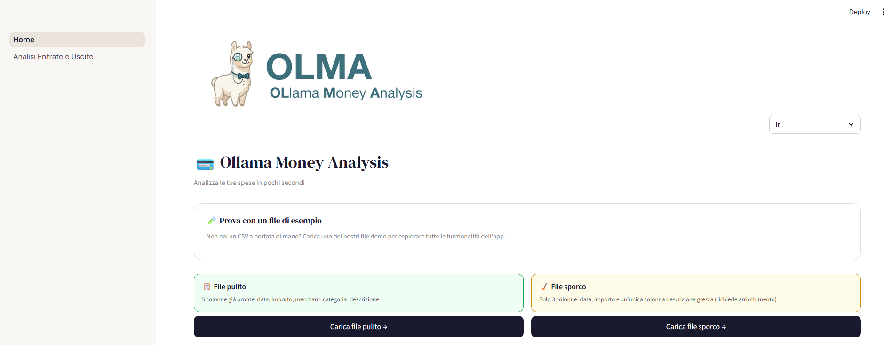
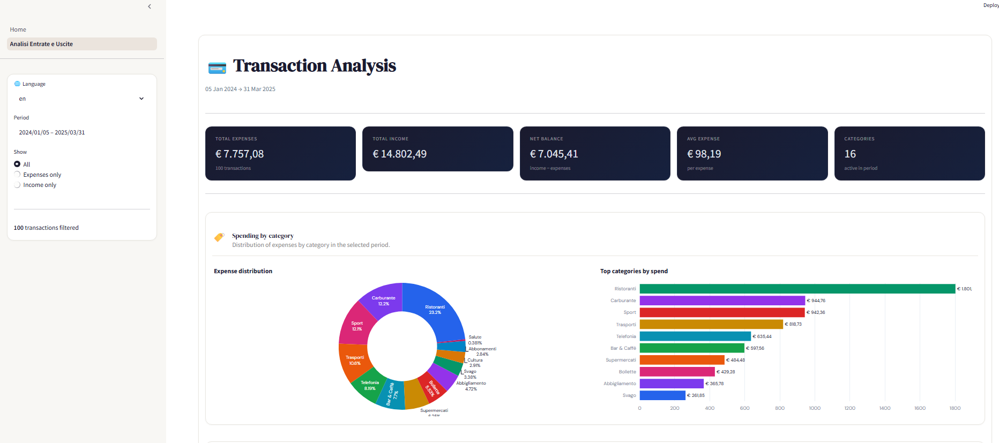
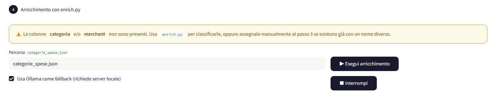

<p align="center">
  
</p>

<p align="center">
  🇬🇧 <a href="README.md">English version</a>
  &nbsp;|&nbsp;
  <a href="https://github.com/chiaraCarrino/OLMA-Ollama-Money-Analysis/pkgs/container/olma-ollama-money-analysis">
    
  </a>
</p>

---

### *Hai mai provato ad analizzare i tuoi movimenti bancari e ti sei ritrovata a fissare un CSV con date in tre formati diversi, importi con separatori decimali inconsistenti, colonne chiamate "Importo Transazione (Carta di Finanziamento)" e merchant scritti come `POS 00234 VISA CARREFOUR MKT`?*

Le soluzioni online esistono — Spendee, Revolut Analytics, vari strumenti di budget. Ma condividono tutte due problemi fondamentali: **devi caricare i tuoi dati bancari su server di terze parti**, e raramente supportano il formato di esportazione grezzo che la tua banca produce davvero.

**OLMA** nasce da questa frustrazione. È un'applicazione **completamente locale** che gira sulla tua macchina, non invia nessun dato a nessun servizio cloud, e trasforma qualsiasi CSV bancario — per quanto disordinato — in una dashboard di analisi completa che copre tutti gli anni di storico che vuoi esplorare.

---

## Screenshot

<p align="center">
  
  <br/>
  <em>Home — caricamento e mappatura colonne</em>
</p>
<p align="center">
  
  <br/>
  <em>Dashboard — analisi entrate e uscite</em>
</p>
<p align="center">
  
  <br/>
  <em>Chat — domande in linguaggio naturale sui tuoi movimenti</em>
</p>

---

## Cosa fa OLMA

- **Parsing CSV robusto** per export bancari reali: rilevamento automatico del separatore, gestione di righe malformate, individuazione automatica della riga di intestazione anche in file con righe di metadati iniziali
- **Mappatura intelligente delle colonne**: rileva automaticamente le colonne (data, importo, merchant, categoria, descrizione) tramite alias configurabili, con override manuale dall'interfaccia
- **Classificazione ibrida delle transazioni**:
  - *Primo passaggio* — lookup deterministico su un dizionario JSON locale (`categorie_spese.json`)
  - *Secondo passaggio (fallback)* — **LLM locale via Ollama**: nessuna chiamata a OpenAI, nessun dato che lascia la tua rete
- **Interfaccia chat in linguaggio naturale**: fai domande sui tuoi movimenti in italiano — "Quanto ho speso di ristoranti nel 2024?", "Qual è la mia categoria di spesa più alta?", "Media mensile di carburante?" — e ottieni risposte basate sui tuoi dati reali
- **Dashboard di analisi** costruita con Plotly: spesa per categoria, andamento temporale con granularità mensile/settimanale/giornaliera, heatmap categoria×mese, top merchant, risparmio mensile e annuale effettivo con media mobile e saldo cumulativo
- **Esportazione** in CSV filtrato ed Excel
- **Supporto multilingua** (IT / EN)

---

## Architettura agentica

OLMA esegue due pipeline agentiche indipendenti, entrambe completamente locali.

```
AGENTE 1 — Classificazione (batch, offline)    AGENTE 2 — Chat finanziaria (real-time)
────────────────────────────────────────       ──────────────────────────────────────
Input: descrizione grezza CSV                  Input: domanda in linguaggio naturale
       "POS 00234 VISA CARREFOUR MKT"                 "Quanto ho speso in pizza nel 2025?"
            │                                                   │
            ▼                                                   ▼
    Tool 1: lookup_json                            LLM legge la domanda
    (regex + substring sul dizionario)             e sceglie il tool giusto
            │                                                   │
      match? ──NO──▶ Tool 2: classify_llm     ┌────────────────┼───────────────┐
            │         (Ollama, output JSON)    ▼                ▼               ▼
            ▼                           compute_          search_          query_
      Cache persistente su disco         statistics        text             dataframe
      (shelve + hash MD5)               (aggregazioni)   (str.contains)   (pandas)
            │                                   │
            ▼                                   ▼
    {merchant, categoria,              Risultato già calcolato
     confidenza, fonte}               → LLM formula la risposta
```

### Perché due agenti separati?

I due compiti hanno requisiti fondamentalmente diversi. La classificazione viene eseguita una volta per transazione, in modo deterministico, al momento dell'importazione — richiede velocità e coerenza. L'agente chat gira in modo interattivo e deve capire l'intenzione dell'utente, selezionare il calcolo corretto e spiegare i risultati in linguaggio naturale. Tenerli separati significa che ognuno può essere ottimizzato indipendentemente.

### Entrambi usano Ollama — ma con modelli diversi

Ollama è il *runtime* locale: il sistema che scarica, gestisce e serve i modelli sulla tua macchina. Non è un modello specifico, è l'infrastruttura. I due agenti scelgono modelli diversi perché i loro compiti hanno difficoltà diverse:

| | Agente 1 — classificazione | Agente 2 — chat |
|---|---|---|
| Modello consigliato | `llama3.2` (3B parametri) | `qwen2.5:14b` (14B parametri) |
| Perché | Task semplice e ripetitivo: dato un testo, scegli una categoria tra 20. Un modello piccolo basta ed è più veloce. | Task complesso: capire l'intenzione, scegliere il tool giusto, passare parametri JSON corretti. Serve un modello più capace. |
| Protocollo Ollama | `POST /api/generate` — completion singola | `POST /api/chat` — chat con tool calling, turni multipli |
| Volume chiamate | Potenzialmente centinaia all'import (una per transazione non in cache) | Una per domanda dell'utente |

In entrambi i casi **nessun dato lascia la tua macchina** — questa è la garanzia che conta.

### Perché ToolCallingAgent invece di CodeAgent?

L'agente chat usa un pattern di tool calling invece di chiedere al modello di generare codice Python. Con modelli da 7–14B che girano localmente, generare codice pandas sintatticamente valido in modo affidabile è difficile. Selezionare un tool e fornire parametri JSON è un compito molto più semplice — e questi modelli lo gestiscono bene. La selezione del tool, l'estrazione dei parametri e la formattazione del risultato sono gestite interamente dal modello a runtime; nessun routing hardcoded.

### Perché un fallback deterministico?

I modelli locali occasionalmente rispondono in prosa invece di chiamare un tool. Un fallback basato su parole chiave (`fallback_dispatch`) intercetta questi casi e instrada la query direttamente alla funzione giusta, garantendo che l'utente ottenga sempre una risposta basata sui dati reali — anche quando il modello si comporta in modo inatteso.

---

## Cosa puoi chiedere all'agente chat

L'interfaccia chat capisce domande sui tuoi movimenti in linguaggio naturale:

| Domanda | Cosa succede internamente |
|---|---|
| "Qual è la mia categoria di spesa più alta?" | `compute_statistics(top5_categorie)` |
| "Media mensile ristoranti?" | `compute_statistics(media_mensile_uscite, filtro_categoria=Ristoranti)` |
| "Quanto ho speso di carburante nel 2024?" | `compute_statistics(totale_uscite, filtro_anno=2024, filtro_merchant=...)` |
| "Quanto ho speso in pizza nel 2025?" | `search_text(keyword=pizza, filtro_anno=2025)` |
| "Spesa più alta in assoluto nell'ultimo anno?" | `query_dataframe(df.nlargest(1, '_uscita'))` |
| "Spesa suddivisa per mese?" | `compute_statistics(spesa_per_mese)` |

Se una categoria o un merchant che cerchi non esiste nei tuoi dati, l'agente te lo dice chiaramente e mostra le categorie disponibili — non inventa mai numeri.

---

## Architettura del classificatore

```
Descrizione transazione
        │
        ▼
┌─────────────────────┐
│  Lookup JSON        │  ← regex + substring match su categorie_spese.json
│  (deterministico)   │    confidenza: alta / media
└─────────┬───────────┘
          │ nessun match
          ▼
┌─────────────────────┐
│  LLM Ollama         │  ← modello locale via API REST Ollama
│  (fallback)         │    prompt con output JSON vincolato a 20 categorie
└─────────┬───────────┘
          │
          ▼
┌─────────────────────┐
│  Cache su disco     │  ← shelve + hash MD5 della descrizione
│  (persistente)      │    evita re-inferenza su descrizioni già viste
└─────────────────────┘
```

<p align="center">
  
  <br/>
  <em>Arricchimento con Ollama</em>
</p>

---

## Stack tecnologico

| Layer | Tecnologie |
|---|---|
| UI e routing | Streamlit (multi-page) |
| Elaborazione dati | pandas, Python `csv`, `io` |
| Visualizzazione | Plotly (go + px) |
| Agente classificazione | regex, lookup JSON, Ollama REST API (`/api/generate`) |
| Agente chat | Ollama tool calling (`/api/chat`), `httpx` |
| Caching | Python `shelve` + hash MD5 |
| Containerizzazione | Docker + Docker Compose (profili opzionali) |
| LLM locale — classificazione | Ollama + `llama3.2` |
| LLM locale — chat | Ollama + `qwen2.5:14b` (consigliato) |

---

## Requisiti

- [Docker](https://www.docker.com/products/docker-desktop) e Docker Compose installati
- Nient'altro — Ollama è opzionale (vedi sotto)

---

## Prova senza clonare il repo

Se vuoi avviare OLMA senza scaricare il codice sorgente:

```bash
# 1. Scarica solo i due file di configurazione necessari
curl -O https://raw.githubusercontent.com/chiaracarrino/olma-ollama-money-analysis/main/docker-compose.yml
curl -O https://raw.githubusercontent.com/chiaracarrino/olma-ollama-money-analysis/main/.env.example

# 2. Configura l'ambiente
cp .env.example .env

# 3. Avvia (Docker scarica l'immagine pre-compilata automaticamente)
docker-compose --profile with-ollama up
```

L'immagine pre-compilata è ospitata su GitHub Container Registry e viene scaricata automaticamente — nessun passaggio di build necessario.

> L'immagine Docker viene ricompilata e pubblicata automaticamente ad ogni aggiornamento del branch `main`.

---


## Installazione

```bash
git clone https://github.com/chiaraCarrino/OLMA-Ollama-Money-Analysis.git
cd OLMA-Ollama-Money-Analysis
```

---

## Avvio — scegli il tuo scenario

### Opzione 1 — Hai già Ollama installato sulla tua macchina

Ollama è già in esecuzione sulla tua macchina su `localhost:11434`? Copia il template di configurazione e imposta l'URL:

```bash
cp .env.example .env
```

Apri `.env` e imposta:
```
OLLAMA_URL=http://host.docker.internal:11434/api/generate
```

Poi avvia solo il container dell'app:
```bash
docker-compose up
```

### Opzione 2 — Non hai Ollama e vuoi che Docker gestisca tutto

Docker scaricherà automaticamente Ollama e i modelli necessari (~2–5GB, solo la prima volta):

```bash
docker-compose --profile with-ollama up
```

Il servizio `model-puller` scarica i modelli e poi si ferma da solo. Dalle esecuzioni successive i modelli sono già nel volume Docker e l'avvio è immediato.

### Opzione 3 — Non vuoi usare Ollama

```bash
docker-compose up
```

OLMA funziona anche senza Ollama, usando solo il lookup JSON per la classificazione. Le transazioni non riconosciute dal dizionario vengono assegnate alla categoria *Altro*. L'agente chat non sarà disponibile senza un'istanza Ollama attiva.

---

In tutti i casi, l'app è disponibile su **[http://localhost:8501](http://localhost:8501)**

Per fermarla:
```bash
docker-compose down
```

---

## Modello consigliato

Per la migliore esperienza con entrambi gli agenti, consigliamo di scaricare `qwen2.5:14b` per la chat (o `qwen2.5:7b` se hai meno di 8GB di VRAM) e `llama3.2` per la classificazione:

```bash
ollama pull qwen2.5:14b   # agente chat
ollama pull llama3.2      # agente classificazione
```

---

## Come usare l'app

1. **Carica il tuo CSV** — o prova i file demo inclusi (pulito e disordinato)
2. **Verifica la mappatura colonne** — OLMA le rileva automaticamente; correggi tramite i menu a tendina se necessario
3. **Esegui l'arricchimento** (opzionale) — solo se il tuo CSV non ha colonne categoria/merchant
4. **Avvia l'analisi** — accedi alla dashboard completa
5. **Fai domande** — usa l'interfaccia chat per interrogare i tuoi dati in linguaggio naturale
6. **Filtra ed esplora** — usa la barra laterale per filtrare per intervallo di date e tipo di transazione
7. **Esporta** — scarica il risultato in CSV o Excel

---

## Personalizzare le categorie

Il file `categorie_spese.json` è il dizionario del classificatore. Aggiungere una nuova regola non richiede modifiche al codice:

```json
{
  "Supermercato & Alimentari": [
    "carrefour", "esselunga", "conad", "lidl", "eurospin"
  ],
  "Ristorazione & Bar": [
    "mcdonald", "bar centrale", "just eat", "deliveroo"
  ],
  "Abbonamenti & Servizi digitali": [
    "netflix", "spotify", "amazon prime"
  ]
}
```

Il matching è case-insensitive e supporta sia il match esatto su word boundary (confidenza alta) che il match per sottostringa (confidenza media).

---

## Privacy

OLMA è progettata con la privacy come vincolo architetturale, non come funzionalità aggiuntiva:

- Nessun dato viene inviato a server remoti
- Sia l'agente di classificazione che l'agente chat usano Ollama localmente: il modello gira sulla tua macchina o nel tuo container Docker
- Tutto rimane su `localhost`
- Nessuna analisi, telemetria o connessione a servizi esterni

---

## Struttura del progetto

```
olma/
├── Home.py                            # Pagina principale: caricamento, mappatura, arricchimento
├── pages/
│   └── 1_Analisi_Entrate_e_Uscite.py  # Dashboard + interfaccia chat
├── enrich.py                          # Agente classificazione: JSON + Ollama
├── chat_agent.py                      # Agente chat: tool calling via Ollama
├── translations.py                    # Stringhe IT/EN
├── categorie_spese.json               # Dizionario categorie (personalizzabile)
├── esempio_pulito.csv                 # File demo pulito
├── esempio_sporco.csv                 # File demo disordinato
├── assets/                            # Immagini per il README
├── images/
│   └── olma_piccola.png
├── Dockerfile
├── docker-compose.yml
├── requirements.txt
├── .env.example
└── .gitignore
```

---

## Roadmap

- [ ] Supporto input XLSX diretto
- [ ] Regole categorie configurabili dall'interfaccia
- [ ] Budget mensile con avvisi
- [ ] Confronto anno su anno per categoria
- [ ] Supporto multi-conto (aggregazione di più file CSV)
- [ ] Persistenza della cronologia chat tra sessioni

---

## Licenza

Apache License 2.0
